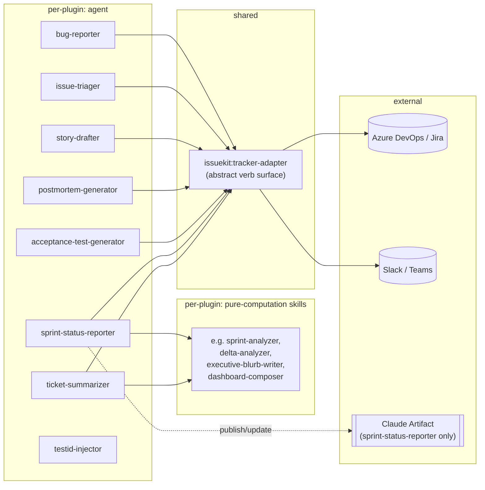

# Architecture: jt-bikanerwala-marketplace

> Extracted from spec 0001 (Pulse dashboard) §7 and reconfirmed by spec 0002 (ticket-summarizer brief export) §7.
> This is the project-wide architectural reference. Future Anthara commands (spec-writer, plan-implementer, review) read this file directly rather than re-deriving the style per spec.

## 1. Style and rationale

**Style:** *pipe-and-filter* (phase-orchestrated agent + pure-computation skills).

Every plugin in this marketplace is a Claude Code plugin: one agent (`agents/<name>.md`) that orchestrates a fixed, numbered sequence of phases, calling out to sibling skills (`skills/<name>/SKILL.md`) for the deterministic computation each phase needs. A skill takes an already-fetched, already-computed payload in, and returns a payload out; it never fetches its own input and never performs a side effect the agent didn't ask for. This holds across all nine plugins in the repo (`bug-reporter`, `issue-triager`, `story-drafter`, `postmortem-generator`, `acceptance-test-generator`, `sprint-status-reporter`, `ticket-summarizer`, `issuekit`, `testid-injector`), confirmed directly against every agent's and skill's `tools:` frontmatter.

This style fits the domain precisely: every plugin's job is "read some tracker/chat/code state, transform it deterministically, emit a report or a write-batch" — there is no long-lived runtime process, no shared mutable state between runs, and no need for a different style (event-driven, microservices, hexagonal) that domain would call for. Introducing a different style for one new mode or one new flag inside an established plugin would fight this structure for no benefit; every spec written against this repo inherits it rather than re-deciding it.

## 2. Tech stack

| Layer | Choice | Rationale |
|---|---|---|
| Runtime | Claude Code plugin (markdown skill + agent definitions), no application runtime | "The backend" is Claude Code's own agent/skill execution, not a hosted service. There is nothing to deploy, build, or run a server for. |
| Persistence | Local files (snapshots, decks, `.dashboard.json`) under each plugin's configured `output_directory`; one plugin (`sprint-status-reporter`, pulse mode) also uses a Claude Artifact's `db` capability | No database to host or migrate. A plugin reaches for the Artifact `db` only when it needs a live, always-current page a browser can open; everything else is a plain file. |
| Hosting | None for most plugins; Claude Artifact hosting (Anthropic-hosted) for the one plugin that publishes a dashboard | No deploy pipeline anywhere in this repo. A dashboard redeploy is a republish to the same URL, not a build/release process. |
| Tracker access | `issuekit:tracker-adapter`, a shared abstract-verb layer over the Azure DevOps and Jira MCPs | Every plugin that touches a tracker goes through this one adapter; no plugin names a vendor-specific MCP tool directly. This is the repo's one genuinely shared library. |
| Chat | The same adapter's chat verbs (Slack or Teams, auto-detected), used by plugins that offer an optional send step | Chat delivery is explicitly a separate concern from tracker reads/writes and never gates behind the tracker's confirmation flow. |
| Optional external CLIs | `marp-cli` (deck → PPTX/PDF export), OS-native clipboard tools (`xclip`/`xsel`/`wl-copy`/`pbcopy`/`clip.exe`) | Both are probed for, never assumed installed, and both degrade gracefully (a clear message and manual fallback) when absent, rather than failing the run. |
| Auth | Whatever the tracker/chat MCP already provides (a PAT, an OAuth session); no plugin introduces its own auth mechanism | These are single-operator personal tools; there is no multi-tenant or role-based access concern anywhere in the repo. |

## 3. Dependency rules

- **Agent → skill, one directional.** An agent invokes its sibling skills via the `Skill` tool, using the `Calling context: phase=<X>.` convention. A skill never invokes another skill and never invokes the agent.
- **Only the agent performs I/O the skill can't self-contain.** Tracker reads/writes, chat sends, and any *publish to an external system* (a Claude Artifact) happen in the agent alone. A skill may hold `Write` only when its entire responsibility is rendering one already-computed payload into a single self-contained output file (`deck-composer`, `delta-narrator` write their own decks) — never for publishing to an external system, never for reading the clock, and never for orchestrating other skills. `sprint-status-reporter`'s `dashboard-composer` is the sharper case: it returns a payload and holds only `Read`, because publishing that payload requires the `Artifact` tool, which stays agent-only.
- **`Bash` is a least-privilege grant, not a default.** Most skills hold `Read` alone. A handful of read-only research skills (`fix-proposer`, `code-reference-prober`, `story-drafter`'s `codebase-prober`, `issue-triager`'s `requirements-investigator`) add `Bash`/`Grep` because their job is searching the local checkout. On the agent side, `Bash` appears only where a phase genuinely shells out (a capability probe for an optional external CLI, a git/file check) — `bug-reporter` and `postmortem-generator`'s agents, which need neither, simply don't have it.
- **No vendor-specific tool name ever appears outside `issuekit`.** Every other plugin's prose and code talks in the adapter's abstract verbs (`getIssue`, `searchIssues`, `sendMessage`, ...); AzDO/Jira/Slack/Teams tool names live only inside `issuekit/skills/tracker-adapter/adapters/<vendor>/`.

## 4. Module map

| Module | Responsibility | Depends on |
|---|---|---|
| `issuekit/skills/tracker-adapter/` | Detection, identity, the abstract verb surface every other plugin reads/writes through | vendor MCP (Azure DevOps, Jira) |
| `<plugin>/agents/<name>.md` | Orchestrates that plugin's numbered phases; the only module with `Write`/`Bash`/`Artifact` where the plugin needs them | `issuekit:tracker-adapter`, that plugin's own skills |
| `<plugin>/skills/<name>/SKILL.md` | One deterministic transform: payload in, payload out (or, for the small `deck-composer`/`delta-narrator` exception, payload in and its own single file out) | nothing external; pure computation |
| `<plugin>/commands/<name>.md` | Thin CLI entry point; parses nothing beyond dispatch, hands off to the agent | that plugin's agent |

## 5. Cross-cutting concerns

- **Auth.** Delegated entirely to the tracker/chat MCP already configured in the environment; no plugin stores or manages a credential itself.
- **Logging / observability.** None beyond what each plugin prints to the chat transcript itself; there is no centralized log store, since there is no long-lived process to log from.
- **Error handling.** Reads fail loud (stop, tell the caller which call failed, never fabricate a substitute). Writes stop the batch on first failure and report what was written before it, without rolling back. Optional steps (marp-cli export, chat send, file save, clipboard copy) degrade gracefully: a clear message and a manual fallback, never a failed run.
- **Validation.** Every write-capable plugin routes writes through `issuekit`'s diff-and-confirm gate (`references/diff-and-confirm.md`); a batch is confirmed once, not per-field. Read-only plugins (`sprint-status-reporter`, `ticket-summarizer`) have no gate at all, by design, since they touch nothing.
- **Feature flags.** None. A plugin's behavior is controlled by `.claude/tracker-policy.json` (state category mappings, blocked/stale thresholds, output directories, per-tracker type names) with shipped defaults and a lazy-prompt-once-then-persist flow for anything missing.
- **Migrations.** None; every persistence mechanism in the repo is schemaless (JSON files, a Claude Artifact's document store).
- **Audit.** Not applicable at the plugin level; the tracker itself is each vendor's system of record for any write this repo makes.

## 6. Integration points

| System | Owning module | Contract | Failure mode |
|---|---|---|---|
| Azure DevOps / Jira | `issuekit:tracker-adapter` | Abstract verbs (`getIssue`, `searchIssues`, `getIssuesBatch`, `updateFields`, ...) mapped to vendor MCP tools per `references/verbs.md` | Reads stop and report which call failed; writes stop the batch and report partial progress; known gotcha: WIQL search-index replication lag can miss a work item created moments before the query runs |
| Slack / Teams | `issuekit:tracker-adapter`'s chat verbs | `resolveChatUser`, `sendMessage`; never gated behind tracker confirmation | Never thrown; `sendMessage` returns `{sent: false, reason}` in-band, the caller reports and does not retry |
| Claude Artifact | `sprint-status-reporter` agent (pulse mode only) | `Artifact` tool: publish once, `write_db` to update; page reads its own `db` document at runtime | A failed publish leaves no `.dashboard.json` (no duplicate risk); a failed write leaves the prior document and timestamp untouched, never blanked or re-stamped |
| `marp-cli` (optional) | `sprint-status-reporter` agent, deck export step | Local npm CLI, probed via `npx --no-install @marp-team/marp-cli --version` | Absent: markdown deck still written, a manual export command is printed; never fails the run |
| OS clipboard tool (optional) | `ticket-summarizer` agent, clipboard delivery (spec 0002) | `xclip`/`xsel`/`wl-copy`/`pbcopy`/`clip.exe`, probed via `Bash`, first found wins | Absent: the copy offer is skipped silently; a failed copy reports the reason and never retries, printed output stands regardless |

## 7. Forbidden anti-patterns

- A skill performing tracker/chat I/O, reading the clock, or publishing an Artifact. Every one of those is the agent's job alone.
- A skill calling another skill, or calling the agent.
- A vendor-specific MCP tool name appearing anywhere outside `issuekit/skills/tracker-adapter/adapters/<vendor>/`.
- Pushing a tag/label filter into `searchIssues`. Neither AzDO WIQL's `CONTAINS` nor Jira's `labels in (...)` supports the substring semantics this repo's tag filters need; tag matching is always client-side, on every tracker, unconditionally.
- Re-deriving a bucket (Delivered / at-risk / active / etc.) from a raw vendor `state` string instead of the already-resolved `stateCategory`. `state_categories` in `.claude/tracker-policy.json` is the one place that mapping is decided.
- Fabricating any count, blurb, timestamp, or field a fetch didn't actually return. Missing data stays missing; it is never guessed, estimated, or padded.
- Granting `Write`, `Bash`, or `Artifact` to a module by default rather than because a specific phase genuinely needs it (see [§3](#3-dependency-rules)).
- Duplicating another plugin's already-hardened query/filter logic inside a new plugin or mode, rather than extending the plugin that already owns it (the reasoning behind spec 0002 choosing to extend `ticket-summarizer` instead of adding a query panel to `sprint-status-reporter`'s Pulse dashboard).

## 8. How to evolve

- **Adding a new plugin.** One agent (`Skill` + whatever I/O tools its phases genuinely need) plus its sibling pure-computation skills (`Read` only, unless it's a self-contained single-file renderer or a read-only research skill that needs `Bash`/`Grep`). Route every tracker/chat touch through `issuekit:tracker-adapter`; never call a vendor MCP tool directly.
- **Adding a new mode to an existing agent.** Add a new phase branch (see `sprint-status-reporter`'s `mode=pulse`, added in spec 0001, and `ticket-summarizer`'s `--range`/brief-format/clipboard additions in spec 0002). Reuse the existing bootstrap, fetch, and sibling skills where the new mode's needs overlap with an existing one; add a new sibling skill only for genuinely new computation.
- **Splitting a skill.** When a skill's `SKILL.md` starts covering two unrelated computations (a real risk once a skill's "Computation rules" section stops fitting on one scroll), split along the seam and update the agent's phase table to call both.
- **Deprecating a mode or plugin.** Remove its command and phase branch; leave its skills in place only if another mode still calls them, otherwise remove them too. There is no versioned-API concern to manage, since nothing here is a hosted service with external callers.
- **Before reaching for a new architectural style.** Confirm the new capability is not just another phase or mode inside this same pipe-and-filter shape. Every capability shipped in this repo so far has fit inside it; a genuine need for a different style (e.g., a long-lived stateful process, multiple independent writers to shared state) would be a first for this repo and deserves its own explicit spec-level architecture decision, not a silent deviation inside one plugin.

## 9. Decision records (ADRs)

**ADR 1 — Pipe-and-filter architecture for the marketplace.**
Decided in spec 0001 (Pulse dashboard for `sprint-status-reporter`), 2026-09-03.
Context: `sprint-status-reporter` already used a phase-orchestrated agent + pure-computation-skill structure for its `status` and `delta` modes; spec 0001 needed to decide whether adding a `pulse` mode (publishing to a Claude Artifact) called for a different style.
Decision: inherit the existing style verbatim. The agent gains one more phase and the `Artifact` tool; `dashboard-composer` joins `sprint-analyzer`/`delta-analyzer`/`deck-composer`/`delta-narrator` as one more pure-computation sibling skill.
Reconfirmed and inherited without modification in spec 0002 (`ticket-summarizer` brief export), 2026-09-03, extending the same discipline to a second plugin (`ticket-summarizer` gains a `Bash`-scoped clipboard phase) rather than introducing a new style or a new module boundary.

## 10. References

- `docs/specs/0001-pulse-dashboard-spec.md` §7 — where this style was first named and justified.
- `docs/specs/0002-ticket-summarizer-brief-export-spec.md` §7 — where it was reconfirmed and extended to a second plugin.
- Repo-wide `tools:` frontmatter audit (`grep -rn "^tools:" plugins/*/agents/*.md plugins/*/skills/*/SKILL.md`), 2026-09-03 — the evidence base for [§3](#3-dependency-rules)'s dependency rules and [§7](#7-forbidden-anti-patterns)'s anti-pattern list; every one of the nine plugins in the repo was checked, not sampled.
