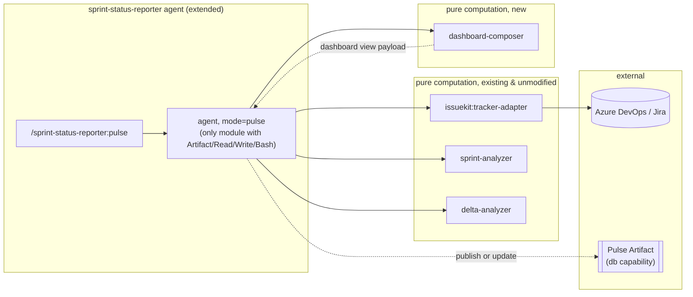
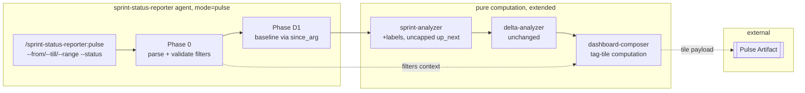

# Spec: Pulse — a live status dashboard for sprint-status-reporter's delta reports

> Owned by: Taha Bikanerwala (taha@incubyte.co)  ·  Started: 2026-09-03  ·  Last revised: 2026-09-03  ·  Spec UUID: e007260a-f942-49ff-a549-0b162da44ff8
> Anthara spec — slice-decomposed, categorically-framed. Feeds /anthara:create-ticket and /anthara:plan-implementer.

---

## 1. Overview & business context

Taha builds a stakeholder-facing PPT every Monday and Thursday summarizing Rolai's Azure DevOps work: what shipped, what's in progress, what's stuck. Today that means manually digging through tickets. He already owns two pieces of the solution: `ticket-summarizer` (turns tickets into client-facing prose) and `sprint-status-reporter` (computes point-in-time and delta sprint metrics, and already renders Marp decks exportable to PPTX). What's missing is a way to *check status between report days* without re-running a command — a persistent view, not just a point-in-time report. This spec adds **Pulse**: a small, new `pulse` mode on the existing `sprint-status-reporter` agent that publishes its already-computed metrics and delta into a private, always-current dashboard (a Claude Artifact), refreshed automatically once daily and on demand by re-running the command.

## 2. Sources

| ID | Type | Contributor | Date | Description |
|---|---|---|---|---|
| 1 | Live brainstorming + spec-writing session with Taha | Taha | 2026-09-03 | System shape (agent pipeline + living dashboard), refresh model (daily cron + on-demand command, in-page button ruled out), Delivered = Closed-only, Risks & Blockers = current + newly-stuck, code location (extend sprint-status-reporter), spec location |
| 2 | Codebase: `jt-bikanerwala-marketplace/plugins/sprint-status-reporter/` | n/a | 2026-09-03 | Existing agent (`agents/sprint-status-reporter.md`) and skills (`sprint-analyzer`, `delta-analyzer`, `deck-composer`, `delta-narrator`); phase-orchestrated pipe-and-filter pattern; `at_risk`/`newly_blocked`/`newly_stale` fields already computed |
| 3 | Codebase: `jt-bikanerwala-marketplace/plugins/issuekit/skills/tracker-adapter/references/policy-schema.md` | n/a | 2026-09-03 | `.claude/tracker-policy.json` schema, incl. `state_categories`, `blocked_indicators`, lazy-prompt behavior for unmapped states |
| 4 | Codebase: Rolai repo `.mcp.json` | n/a | 2026-09-03 | Azure DevOps MCP config (`@azure-devops/mcp`, org `rolaillc`, PAT from `server/.env`) |
| 5 | Org Memory (`search_memories`: "ticket-summarizer", "Azure DevOps", "Pulse dashboard") | Fabric | 2026-09-03 | Prior use of `ticket-summarizer` for recurring updates; `sprint-status-reporter` previously run against Rolai (evidenced by `sprint-reports/.snapshots/` dated 2026-07-21, now empty) |
| 6 | Claude Artifact runtime capabilities (`db`, `artifact`) | Anthropic platform docs | 2026-09-03 | `db` capability shape (realtime JSON doc store, private by default), CSP restrictions on raw fetch from a published page, `mcp` capability requiring a claude.ai-level connector (Azure DevOps is not one; it's a project-local MCP) |
| 7 | `jt-bikanerwala-marketplace/docs/ARCHITECTURE.md` | n/a | 2026-09-03 | Standalone architecture reference extracted from this spec's §7, covering the whole marketplace's pipe-and-filter convention |
| 8 | Codebase: `jt-bikanerwala-marketplace/plugins/ticket-summarizer/agents/ticket-summarizer.md`, `commands/run.md` | n/a | 2026-09-04 | Exact `--range` preset table, `--status` split/map/dedupe resolution and validation, and `--tags` substring-match convention that [slice 5.3](#53-filter-pulse-by-date-range-and-status-and-regroup-its-dashboard-by-tag) mirrors for its own `--from`/`--till`/`--range`/`--status` flags |
| 9 | Live clarifying conversation with Taha, 2026-09-04 | Taha | 2026-09-04 | Date range must never hide active tickets, only bound which closed/new tickets show; the "new since last refresh" count; the choice to replace (not append to) the section-based layout with tag tiles |

## 3. Type ontology

### 3.1 Kinds of users

- **Report author** — Taha, the sole operator and viewer. Runs the pulse command (manually or via schedule), views the dashboard, and pulls its "Copy for deck" content into the Monday/Thursday PPT. [1]

### 3.2 Kinds of data

- **SprintItem** — a work item as fetched from the tracker: `id, title, type, state, stateCategory, assignee, points, remainingWork, updated, labels, description`. [2]
- **Metrics model** — `sprint-analyzer`'s point-in-time computation: bucket totals, progress, `completed`/`in_progress`/`at_risk`/`up_next` lists, capacity summary, warnings. [2]
- **Delta model** — `delta-analyzer`'s diff of a baseline metrics model against the current one: `shipped`, `started`, `added`, `removed`, `newly_blocked`, `newly_stale`, `regressed`, `reassigned`, headline movement. [2]
- **Snapshot** — a JSON file capturing a point-in-time `SprintItem[]` + metrics model, written under `<output_directory>/.snapshots/`. Existing mechanism, unmodified by this spec. [2]
- **Dashboard document** — the Pulse Artifact's persisted view data: the current metrics model, the current delta model, and a `generatedAt` timestamp, stored in the Artifact's `db` capability. [1, 6]
- **Tag tile** — a per-`SprintItem.labels`-entry aggregation on the dashboard (or the reserved `Untagged` sentinel for items with no labels): an active count, a closed count, and the two underlying ticket lists. Introduced by [slice 5.3](#53-filter-pulse-by-date-range-and-status-and-regroup-its-dashboard-by-tag). [9]
- **New-since callout** — `delta.added`, re-surfaced on the dashboard as a headline count plus its ticket list, labeled by the resolved baseline date. Introduced by [slice 5.3](#53-filter-pulse-by-date-range-and-status-and-regroup-its-dashboard-by-tag). [9]

### 3.3 Kinds of events

- **Pulse run** — `/sprint-status-reporter:pulse` invoked, either manually or by the scheduled trigger. [1]
- **Dashboard publish** — the first pulse run for a project: a new private Artifact is created and its URL persisted. [1]
- **Dashboard update** — any later pulse run: the existing Artifact's `db` document is overwritten with fresh data; the page itself is not republished. [1]
- **Scheduled trigger** — the daily cron firing a pulse run automatically. [1]

### 3.4 Kinds of states (dashboard bucket categories)

- **Delivered** — items whose current `stateCategory` resolves to `done` under the project's `state_categories` policy. For Rolai: only `state == "Closed"` (policy maps `Resolved`, `Prod Ready`, `On Hold`, `Blocked`, `Active` to `in_progress`, `New` to `todo`, `Closed` alone to `done`). [1, 2, 3]
- **In Progress** — items whose current `stateCategory` is `in_progress` and that are not currently in the at-risk list. [2]
- **Currently at risk** — every item in the current metrics model's `at_risk` list (blocked or stale, per `blocked_indicators`/`stale_after_days`), regardless of when it became at-risk. [2]
- **Newly at risk** — the subset of currently-at-risk items also present in `delta.newly_blocked` or `delta.newly_stale` — i.e. became at-risk since the comparison baseline. [2]

## 4. Invariants

**4.1 One dashboard per project** — a given project (repo + tracker + team scope) has at most one Pulse Artifact. The first pulse run creates it and persists its URL; every later run updates that same Artifact rather than creating a duplicate. Sources: [1].

**4.2 Delivered means done-category, never inferred** — an item appears under Delivered only when its `stateCategory` resolves to `done` per policy. The dashboard never infers delivery from a ticket's title, description, or any signal other than `stateCategory`. Sources: [1, 2].

**4.3 Read-only against the tracker** — pulse mode never writes to Azure DevOps or Jira. Its only side effects are the existing snapshot file and the Artifact's own store. Inherited unmodified from the plugin's existing invariant across status and delta modes. Sources: [2].

**4.4 No fabricated numbers or claims** — every count, blurb, and timestamp on the dashboard traces to a real fetched `SprintItem` field or a real computed model field. Missing data (points, description, history) is shown as missing, never invented. Mirrors `sprint-analyzer`/`delta-analyzer`'s existing anti-pattern rules. Sources: [2].

**4.5 A date window narrows only closed tickets, never active ones** — when a `--from`/`--till`/`--range` window is applied ([slice 5.3](#53-filter-pulse-by-date-range-and-status-and-regroup-its-dashboard-by-tag)), every currently non-done (`stateCategory != done`) ticket still appears in full, in its tag's active count and list, on every run. The window narrows only which done-category tickets count as "closed" (those that shipped within it) and which tickets count as "new" (added within it); it never hides an active ticket. Sources: [9].

**4.6 Multi-tag fan-out, never silent loss** — a ticket carrying two or more `labels` entries appears once under each of its tags' tiles and lists, never deduplicated away. A ticket carrying no labels appears once under a single reserved `Untagged` tile. No ticket is ever dropped from every tile. Sources: [9].

## 5. Slices

### 5.1 Publish or update the Pulse dashboard from a sprint's current delta

Taha runs `/sprint-status-reporter:pulse` (or it runs later via schedule — [slice 5.2](#52-keep-the-dashboard-fresh-automatically-via-a-daily-schedule)) against a project. The command runs the plugin's existing pipeline — bootstrap, resolve sprint, fetch, analyze, snapshot, resolve baseline, diff — then composes and publishes a private Pulse dashboard. The dashboard has two views: a live status view (Delivered, In Progress, Risks & Blockers split into currently-stuck and newly-stuck, each item with its plain one-line blurb) and a "Copy for deck" view rendering the same three sections as paste-ready plain text. The first run for a project creates the Artifact and remembers its URL; every later run — including a manual re-run, which is the on-demand refresh path — updates that same Artifact in place ([invariant 4.1](#4-invariants)). The dashboard's URL persists at `<output_directory>/.dashboard.json`, a sibling to the existing `.snapshots/` directory, following the same convention.

- **Touches types:** SprintItem, Metrics model, Delta model, Snapshot, Dashboard document, Pulse run, Dashboard publish, Dashboard update, Delivered, In Progress, Currently at risk, Newly at risk.
- **Preserves invariants:** [4.1](#4-invariants), [4.2](#4-invariants), [4.3](#4-invariants), [4.4](#4-invariants).
- **Affected modules:** `plugins/sprint-status-reporter/commands/pulse.md` (new), `plugins/sprint-status-reporter/agents/sprint-status-reporter.md` (extend: `mode=pulse` phase, add `Artifact` to the `tools:` frontmatter), `plugins/sprint-status-reporter/skills/dashboard-composer/SKILL.md` (new).
- **Active packs:** none. This is a personal tooling repo with no compliance pack scoped to it (`get_standards` returned only generic org-wide clean-code conventions — see [§6](#6-nfrs--regulatory-compliance)).
- **Reachability:** `root → /sprint-status-reporter:pulse [sprint] [--team <name>]`.

**Acceptance criteria**

- [ ] **5.1.1** Running `/sprint-status-reporter:pulse` with no arguments against a project with no prior `.dashboard.json` creates a new private Artifact, prints its URL, and persists the URL at `<output_directory>/.dashboard.json`.
- [ ] **5.1.2** Running the command again against the same project reads the persisted URL and updates that same Artifact's `db` document rather than creating a second one.
- [x] ~~**5.1.3** The dashboard's Delivered section lists exactly the items whose current `stateCategory` is `done` per the project's policy, each with its one-line blurb, id, and title.~~ **Superseded by [5.3.9](#53-filter-pulse-by-date-range-and-status-and-regroup-its-dashboard-by-tag)** — a top-level Delivered section no longer exists; done-category tickets appear as each tag tile's closed list instead.
- [x] ~~**5.1.4** The dashboard's In Progress section lists items whose current `stateCategory` is `in_progress` and that are not in the current `at_risk` list.~~ **Superseded by [5.3.9](#53-filter-pulse-by-date-range-and-status-and-regroup-its-dashboard-by-tag)** — a top-level In Progress section no longer exists; non-done tickets appear as each tag tile's active list instead.
- [x] ~~**5.1.5** The dashboard's Risks & Blockers section shows two parts: every item currently in `at_risk` (with its reason: `blocked: <indicator>` or `stale: <n>d`), and a separate "new since last check" callout listing only the items also present in `delta.newly_blocked` or `delta.newly_stale`.~~ **Superseded by [5.3.10](#53-filter-pulse-by-date-range-and-status-and-regroup-its-dashboard-by-tag)** — a top-level Risks & Blockers section no longer exists; at-risk tickets carry their reason as a per-ticket badge within their tag's active list instead.
- [x] ~~**5.1.6** A "Copy for deck" view renders the same three sections (Delivered / In Progress / Risks & Blockers) as plain paste-ready text, with a one-click copy control.~~ **Superseded by [5.3.12](#53-filter-pulse-by-date-range-and-status-and-regroup-its-dashboard-by-tag)** — the copy control is unchanged, but the text it copies now mirrors the tag-tile layout, not the three old sections.
- [x] **5.1.7** The dashboard always shows a visible "last updated" timestamp reflecting when its data was last successfully refreshed.
- [x] **5.1.8** When no prior snapshot exists and no baseline can be resolved (the plugin's existing "baseline established, nothing to compare yet" case), the dashboard still publishes a point-in-time view (tag tiles built from the current metrics alone, per [5.3](#53-filter-pulse-by-date-range-and-status-and-regroup-its-dashboard-by-tag)) and states plainly that no delta is available yet — it never fabricates a "no changes" delta.
- [x] **5.1.9** Every number and item blurb on the dashboard traces to a real fetched `SprintItem` or a real computed model field; nothing is invented when points, description, or history are missing ([invariant 4.4](#4-invariants)).

> **Verification status at build time (2026-09-03).** The dashboard page was driven end to end
> against fixtures built from `sprint-analyzer`'s and `delta-analyzer`'s documented output
> schemas (60 assertions, all green; each backed by a mutation that turns it red), covering
> 5.1.3 through 5.1.9 and the accessibility bar. 5.1.1 and 5.1.2 rest on the `Artifact` tool
> contract confirmed against the live tool schema and two observed real publish/update calls,
> but were **not** executed against a live tracker: no tracker MCP was reachable from the build
> session, so [§9.1](#9-open-questions) is still open and the first real run is still the probe
> for it. Left unchecked above until that first real run confirms them live.

**Verification (slice complete when these pass):**

1. **Tests.** This plugin family has no automated test suite — it is markdown skill/agent definitions, not application code with a test runner. Verify behaviorally: invoke `/sprint-status-reporter:pulse` against a real or sandboxed tracker project and confirm the published dashboard's data matches `sprint-analyzer`'s and `delta-analyzer`'s documented output schemas exactly (no reshaping, no invented fields).
2. **Migrations.** Not applicable — the Artifact's `db` is a schemaless JSON document store; no migration step exists.
3. **User-facing flow.** Drive the published Pulse Artifact URL end-to-end through the `chrome-devtools-mcp` browser session: confirm the live view renders Delivered / In Progress / Risks & Blockers with real data, the "last updated" timestamp is present, and the "Copy for deck" view's copy control actually places the expected text on the clipboard.
4. **Accessibility.** In the same browser session: tab-order traversal reaches every interactive control (view toggle, copy button), focus is visible on each, and text meets baseline contrast at default zoom — no WCAG pack is active for this repo, but this is a real UI surface and should meet a reasonable baseline regardless.

### 5.2 Keep the dashboard fresh automatically via a daily schedule

Beyond manual on-demand runs, a Claude Code scheduled cron invokes `/sprint-status-reporter:pulse` against the Rolai project once every morning, so opening the dashboard on any day — not just Monday or Thursday — shows data that's at most a few hours old, with no action from Taha.

- **Touches types:** Pulse run, Scheduled trigger, Dashboard update.
- **Preserves invariants:** [4.1](#4-invariants), [4.3](#4-invariants).
- **Affected modules:** none in the plugin's code — a Claude Code cron registration is platform configuration, not a repo file. `plugins/sprint-status-reporter/README.md` gets a short section documenting the recommended schedule setup.
- **Active packs:** none.
- **Reachability:** `/sprint-status-reporter:pulse (5.1) → scheduled trigger`.

**Acceptance criteria**

- [ ] **5.2.1** A scheduled cron job exists that invokes `/sprint-status-reporter:pulse` against the Rolai project once daily. Platform configuration, not a repo file; this PR documents the recommended setup in the README but does not itself register the job. Left unchecked until Taha registers the cron and confirms it fires.
- [x] **5.2.2** A scheduled run updates the existing Pulse Artifact in place, per [invariant 4.1](#4-invariants) — identical behavior to a manual re-run.
- [x] **5.2.3** A failed scheduled run (e.g. the tracker MCP is unreachable that morning) does not blank or corrupt the previously published dashboard. The dashboard keeps showing its last successful data, and the "last updated" timestamp from [AC 5.1.7](#51-publish-or-update-the-pulse-dashboard-from-a-sprints-current-delta) stays honest about staleness rather than silently advancing.

**Verification (slice complete when these pass):**

1. **Tests.** Not applicable beyond [5.1](#51-publish-or-update-the-pulse-dashboard-from-a-sprints-current-delta)'s coverage — this slice adds a schedule registration, not new logic.
2. **Migrations.** Not applicable.
3. **User-facing flow.** Trigger the scheduled job once (or wait for its next scheduled fire) and confirm the dashboard's "last updated" timestamp advances and its data matches a manual run taken at the same time.
4. **Accessibility.** Not applicable — this slice introduces no new UI surface; [5.1](#51-publish-or-update-the-pulse-dashboard-from-a-sprints-current-delta) already covers the dashboard's accessibility.

### 5.3 Filter Pulse by date range and status, and regroup its dashboard by tag

Taha's stakeholder deck needs two things the section-based dashboard from [5.1](#51-publish-or-update-the-pulse-dashboard-from-a-sprints-current-delta) cannot give him: a way to bound which *closed* tickets show up by when they closed, and a per-area (per-tag) breakdown he can read off directly instead of mentally regrouping a flat Delivered/In Progress list by component. `/sprint-status-reporter:pulse` gains `--from`/`--till`/`--range` and `--status`, mirroring `/ticket-summarizer:run`'s exact flag vocabulary and validation ([source 8](#2-sources)) — but their *meaning* here is Pulse's own, not a duplicate of ticket-summarizer's query pipeline ([invariant 4.5](#4-invariants); see the rejected alternative in the accompanying plan's Decisions). A resolved window becomes the `since_arg` Phase D1 already understands (delta mode has taken `--since` since spec inception), so this slice extends an existing internal mechanism rather than adding a new one. The dashboard's content model also changes from four fixed sections to one tile per `labels` entry, each carrying an active count and a closed count, followed by that tag's exact ticket list.

- **Touches types:** SprintItem, Metrics model, Delta model, Dashboard document, Pulse run, Dashboard update, plus the new Tag tile and New-since callout ([§3.2](#32-kinds-of-data)).
- **Preserves invariants:** [4.2](#4-invariants), [4.3](#4-invariants), [4.4](#4-invariants); introduces and preserves [4.5](#4-invariants), [4.6](#4-invariants).
- **Affected modules:** `plugins/sprint-status-reporter/commands/pulse.md` (rewrite: new flags, examples, behavior), `plugins/sprint-status-reporter/agents/sprint-status-reporter.md` (Arguments, Working state, Phase 0, Phase D1, Phase P2, Phase 5), `plugins/sprint-status-reporter/skills/sprint-analyzer/SKILL.md` (extend: `labels` passthrough, optional uncapped `up_next`), `plugins/sprint-status-reporter/skills/dashboard-composer/SKILL.md` (rewrite: tag-tile computation replaces the four-bucket table), `plugins/sprint-status-reporter/skills/dashboard-composer/references/dashboard-page.html` (rewrite: dynamic tile rendering), `plugins/sprint-status-reporter/.claude-plugin/plugin.json` (version bump; description update).
- **Active packs:** none (spec §6, unchanged from 5.1/5.2).
- **Reachability:** `root → /sprint-status-reporter:pulse [sprint] [--team <name>] [--from <date> --till <date> | --range <preset>] [--status <value>[,...]]`.

**Acceptance criteria**

- [ ] **5.3.1** `/sprint-status-reporter:pulse` accepts `--from <date>`/`--till <date>` or `--range this-week|last-week|this-month|last-month`, resolved identically to `/ticket-summarizer:run`'s table (Monday-through-today for `this-week`, complete prior period for `last-week`, same for the monthly presets), mutually exclusive with `--from`/`--till`, validated before any fetch.
- [ ] **5.3.2** `/sprint-status-reporter:pulse` accepts `--status <value>[,...]` from `active|delivered|closed|updated`, with `delivered`/`closed` as synonyms and `updated` valid only alone, validated with the same stop-and-name-the-accepted-set behavior as `/ticket-summarizer:run`.
- [ ] **5.3.3** When a `from` date resolves (explicit or via `--range`), Phase D1 resolves its baseline using that date as `since_arg`, exactly as delta mode's existing `--since` mechanism already does, instead of the default "newest snapshot before today."
- [x] **5.3.4** When `--till` resolves, it bounds the closed and new-since ticket lists to entries whose `updated` date is on or before it; it never re-derives a second point-in-time reconstruction.
- [x] **5.3.5** Every currently non-done ticket appears in full in its tag's active count and list on every run, regardless of any date window applied ([invariant 4.5](#4-invariants)).
- [x] **5.3.6** When a baseline resolves, a tag's closed count and list are exactly `delta.shipped` filtered to that tag (tickets that transitioned to done within the resolved window) — not every historically-done ticket in the sprint.
- [ ] **5.3.7** When no baseline has resolved yet (first run for a project), closed counts and lists fall back to every currently-done ticket per tag, and the dashboard states plainly this is a point-in-time view, per the existing no-baseline handling ([5.1.8](#51-publish-or-update-the-pulse-dashboard-from-a-sprints-current-delta)).
- [ ] **5.3.8** `--status active` shows only active tiles/lists (closed omitted entirely); `--status closed` (or `delivered`) shows only closed tiles/lists, scoped per 5.3.6/5.3.7; omitting `--status` shows both.
- [x] **5.3.9** The dashboard groups every ticket by its `labels` entries into one tile per tag, each tile showing an active count and a closed count.
- [ ] **5.3.10** A ticket with two or more labels appears under each of its tags' tiles and lists; a ticket with no labels appears once under a reserved `Untagged` tile, always rendered last ([invariant 4.6](#4-invariants)). At-risk tickets carry their `blocked:`/`stale:` reason as a badge on their row within their tag's active list.
- [ ] **5.3.11** Below the tiles, each tag's exact ticket list (active tickets, then closed tickets) shows id, title, state, assignee, points, and blurb when available.
- [ ] **5.3.12** The "Copy for deck" plain-text view mirrors the tile layout (tag headings, active/closed counts, one line per ticket, id-ascending order, `None.` for an empty list) with the same one-click copy control as before.
- [x] **5.3.13** No tile or ticket list is ever capped or truncated (carries forward `dashboard-composer`'s existing "no display caps" rule).
- [ ] **5.3.14** The dashboard shows a "New since `<resolved baseline date>`" count and the underlying ticket list, sourced from `delta.added` and scoped to the same resolved window, shown whenever a delta is available and unaffected by `--status`.
- [x] **5.3.15** Every number and ticket-list entry traces to a real fetched `SprintItem` or a real computed model field; nothing is invented when points, description, or history are missing ([invariant 4.4](#4-invariants)).

> **Verification status at build time (2026-09-04, slice 3 of the accompanying plan).**
> `dashboard-composer`'s rewritten tag-tile rules were driven against a hand-built
> `metrics`/`delta` fixture pair covering a multi-tag ticket, an untagged ticket, a blocked
> ticket that is also newly blocked, a shipped entry falling outside a test `till`, a `till`
> boundary timestamp, a `delta: null` first run, and both `--status` gatings (51 assertions,
> all green). Each assertion is backed by a mutation that turns it red; the mutation that
> narrows the active pool by `till` turns 13 red, including both window-blindness assertions,
> which is [invariant 4.5](#4-invariants)'s guard. 5.3.4, 5.3.5, 5.3.6, 5.3.9, 5.3.13 and
> 5.3.15 are decided entirely inside that skill and are checked above on this evidence.
> 5.3.1-5.3.3 await a live tracker run (flag parsing and baseline resolution); 5.3.7, 5.3.8,
> 5.3.10, 5.3.11, 5.3.12 and 5.3.14 carry a rendering half that needs the `dashboard-page.html`
> rewrite (slice 4) before it can be observed end to end. No tracker MCP was reachable from
> this build session, so [§9.1](#9-open-questions) stays open.

**Verification (slice complete when these pass):**

1. **Tests.** No automated test suite in this plugin family (markdown skill/agent definitions). Verify behaviorally: invoke `/sprint-status-reporter:pulse` with each new flag combination against a real or sandboxed tracker project and confirm the published payload matches `sprint-analyzer`'s, `delta-analyzer`'s, and the revised `dashboard-composer`'s documented output schemas exactly.
2. **Migrations.** Not applicable.
3. **User-facing flow.** Drive the published Pulse Artifact URL through a `chrome-devtools-mcp` browser session: confirm tag tiles render with correct active/closed counts, a multi-tag ticket appears under every one of its tags, an untagged ticket appears under `Untagged`, the New-since callout shows when a delta is available, and the "Copy for deck" view's copy control places the tile-shaped text on the clipboard.
4. **Accessibility.** Same browser session: tab order reaches every tile and interactive control, focus is visible, and text meets baseline contrast at default zoom, preserving the 44×44 touch targets and ARIA tablist semantics [5.1](#51-publish-or-update-the-pulse-dashboard-from-a-sprints-current-delta) already established.

## 6. NFRs & regulatory compliance

No compliance pack (HIPAA, PCI, WCAG, or otherwise) is scoped to `jt-bikanerwala-marketplace` — it is Taha's personal tooling repo, not a regulated product codebase. `get_standards` for this repo returned only generic org-wide clean-code conventions (241 rules; e.g. "keep controllers and adapters thin," "no fabricated data," pure-function discipline), not a pack-specific ruleset. This section is accordingly light; there is no §6.N control coverage matrix because no regulatory control applies.

### 6.1 General code-quality conventions carried forward from the existing codebase

**6.1.1 Pure computation stays pure.** `dashboard-composer` follows the same discipline as `sprint-analyzer` and `delta-analyzer`: no tracker access, no file I/O, no clock reads, deterministic output for the same input. Only the agent — which already holds `Read`/`Write`/`Bash` and gains `Artifact` in this spec — performs the actual publish/update. Sources: [2].

**6.1.2 No fabricated data.** The dashboard must never present a count, blurb, or timestamp that was not computed from real input, mirroring `sprint-analyzer`'s and `delta-analyzer`'s existing "never invent" rules. Sources: [2].

**6.1.3 Baseline accessibility on the dashboard UI.** Even with no WCAG pack active, the published Artifact should meet a reasonable accessibility baseline as a matter of general quality: keyboard reachability, visible focus, sufficient contrast. Sources: [1].

## 7. Architecture

### 7.1 Tech stack

| Layer | Choice | Rationale |
|---|---|---|
| Runtime | Claude Code plugin (markdown skill + agent definitions), no application runtime | Matches the existing `sprint-status-reporter` plugin exactly; "the backend" is Claude Code's own agent/skill execution, not a hosted service. [2] |
| Persistence | Claude Artifact `db` capability (realtime JSON document store) | Nothing to host, migrate, or back up; private to Taha by default. Matches the "no new infra" decision from the brainstorming phase. [1, 6] |
| Hosting | Claude Artifact hosting (Anthropic-hosted) | No deploy pipeline; a redeploy is a republish to the same URL. [6] |
| Scheduling | Claude Code scheduled cron (`/schedule`) | Native to the platform already running the agent; no external cron infrastructure. [1] |
| Auth | None beyond the Artifact's own default privacy | Single-user personal tool; a private Artifact is scoped to its owner by default. [1, 6] |

### 7.2 Architectural style

**Style:** *pipe-and-filter* (phase-orchestrated agent + pure-computation skills) — inherited verbatim, not re-chosen.

**Why this style here:** The existing `sprint-status-reporter` codebase already established this style precisely: the agent orchestrates numbered phases, each phase invokes a stateless, deterministic skill via the `Calling context: phase=X.` convention, and only the agent holds I/O-capable tools. This spec's `mode=pulse` is one more phase in that same pipeline; `dashboard-composer` is one more pure-computation skill sibling to `sprint-analyzer`, `delta-analyzer`, `deck-composer`, and `delta-narrator`. Introducing a different style for one new mode inside an established single-agent plugin would fight the existing structure for no benefit.

**Dependency direction:** agent → skills, one-directional. Skills never call other skills or the agent; only the agent touches `Read`/`Write`/`Bash`/`Artifact`.

**Anti-patterns the style forbids:** a computation skill performing I/O or reading the clock; a skill invoking another skill or the agent directly; Rolai-specific business rules (Closed-only delivery, etc.) hardcoded into plugin code rather than expressed through the existing `state_categories`/`blocked_indicators` policy mechanism ([§3.4](#34-kinds-of-states-dashboard-bucket-categories)).

### 7.3 Module decomposition

See the diagram and Reachability under [slice 5.1](#51-publish-or-update-the-pulse-dashboard-from-a-sprints-current-delta) — the module shape and the slice's data flow are the same diagram; repeating it here would say the same thing twice.

| Module | Responsibility | Depends on |
|---|---|---|
| `commands/pulse.md` (new) | Thin CLI entry; dispatches to the agent with `mode=pulse` | agent |
| `agents/sprint-status-reporter.md` (extended) | Orchestrates phases; the only module with `Artifact`/`Read`/`Write`/`Bash` | `issuekit:tracker-adapter`, `sprint-analyzer`, `delta-analyzer`, `dashboard-composer` |
| `skills/dashboard-composer/` (new) | Pure: metrics model + delta model → dashboard view payload (live-view rows + copy-for-deck text) | `sprint-analyzer`'s and `delta-analyzer`'s output shapes |
| `skills/sprint-analyzer/`, `skills/delta-analyzer/` (existing, unmodified) | Point-in-time metrics; delta diff | `issuekit`'s `SprintItem` shape |
| `issuekit:tracker-adapter` (existing, unmodified) | Tracker detection + abstract verb surface | vendor MCP |

### 7.5 Threat model seed

Low-sensitivity, single-user surface: the dashboard carries sprint metadata (ticket ids, titles, blurbs, assignees, dates), not PHI or payment data. The one real consideration is that this data now lives in an Anthropic-hosted Artifact rather than solely under Taha's own infrastructure — mitigated by the Artifact's private-by-default scoping ([source 6](#2-sources)). The Azure DevOps PAT (`server/.env` in the Rolai repo) is a pre-existing credential, unmodified by this spec; pulse mode reads through it exactly as status and delta mode already do, and never writes to the tracker ([invariant 4.3](#4-invariants)).

## 8. Codebase impact map

| Module | Slices that touch it | Likely change shape |
|---|---|---|
| `plugins/sprint-status-reporter/commands/pulse.md` | 5.1 | New file |
| `plugins/sprint-status-reporter/agents/sprint-status-reporter.md` | 5.1 | Extend: new `mode=pulse` phase, add `Artifact` to `tools:` frontmatter |
| `plugins/sprint-status-reporter/skills/dashboard-composer/SKILL.md` | 5.1 | New file |
| `plugins/sprint-status-reporter/README.md` | 5.1, 5.2 | Extend: document `/pulse`, dashboard behavior, recommended schedule setup |
| `plugins/sprint-status-reporter/.claude-plugin/plugin.json` | 5.1 | Version bump; description update |
| Rolai repo `.claude/tracker-policy.json` | 5.1 | Created via the existing lazy-prompt flow on first Rolai run (Rolai's custom states get classified interactively) — not hand-authored as part of this spec's code |
| Claude Code scheduled-job configuration | 5.2 | New cron registration; platform-level, not a repo file |
| `plugins/sprint-status-reporter/commands/pulse.md` | 5.3 | Rewrite: new `--from`/`--till`/`--range`/`--status` flags, examples, behavior description |
| `plugins/sprint-status-reporter/agents/sprint-status-reporter.md` | 5.3 | Extend: Arguments, Working state, Phase 0 filter parsing, Phase D1 `since_arg` reuse, Phase P2 payload widened with `filters`, Phase 5 summary |
| `plugins/sprint-status-reporter/skills/sprint-analyzer/SKILL.md` | 5.3 | Extend: `labels` on every per-item output object, optional uncapped `up_next` |
| `plugins/sprint-status-reporter/skills/dashboard-composer/SKILL.md` | 5.3 | Rewrite: tag-tile computation replaces the four-bucket table; deck-text rules rewritten |
| `plugins/sprint-status-reporter/skills/dashboard-composer/references/dashboard-page.html` | 5.3 | Rewrite: dynamic tag-tile rendering replaces the hardcoded 4-bucket `BUCKETS` array |
| `plugins/sprint-status-reporter/.claude-plugin/plugin.json` | 5.3 | Version bump; description update |

## 9. Open questions

**9.1 Does Rolai's Azure DevOps project use Iterations/Sprints as a first-class, configured concept?** `sprint-status-reporter`'s entire pipeline — both its existing modes and this spec's new `pulse` mode — is sprint-scoped (`getCurrentSprint`, `getSprintItems`). If Rolai runs a continuous-flow board without sprint iterations configured, `getCurrentSprint` returns null and the agent halts before reaching any mode, pulse included. This session had no live Azure DevOps MCP connection to verify Rolai's iteration configuration directly. Awaiting: confirmation from Taha, or a live check against the Rolai ADO project's iteration settings, before slice 5.1 is built. If iterations aren't configured, the fallback is either enabling them in Rolai's ADO project settings, or a design change so pulse mode operates over a rolling date window instead of a sprint boundary — a change worth scoping only if this turns out to be the actual state.

**9.2 Does the Azure DevOps PAT in `server/.env` have sufficient read scope for the Revisions/history API?** Only relevant to the existing history-reconstruction fallback path (Phase D1 case 3, used when no snapshot exists and `--since` is given). Not a blocker for the common path (snapshot-based baselines), but worth a one-time check. Awaiting: confirmation from Taha or a live token-scope check.

---

## Changelog

- 2026-09-03 — Taha Bikanerwala (via Anthara spec-writer) — Initial spec, synthesized from a brainstorming session that discovered and pivoted onto the existing `sprint-status-reporter` plugin rather than building a duplicate delta-computation system [1].
- 2026-09-04 — Taha Bikanerwala (via Anthara planner) — Added [slice 5.3](#53-filter-pulse-by-date-range-and-status-and-regroup-its-dashboard-by-tag): date-range/status filtering via Phase D1's existing baseline mechanism, and a tag-tile dashboard layout replacing the four-bucket section layout. Superseded ACs 5.1.3-5.1.6 accordingly; added invariants 4.5-4.6 and the Tag tile / New-since callout types. See `docs/plans/0001-pulse-dashboard-plan.md` for the build-level decisions, including why this does not duplicate `ticket-summarizer`'s query pipeline (`ARCHITECTURE.md` §7).
