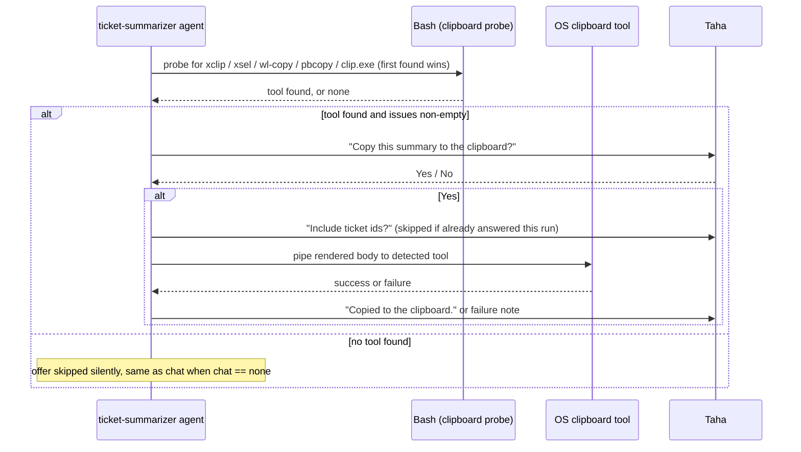
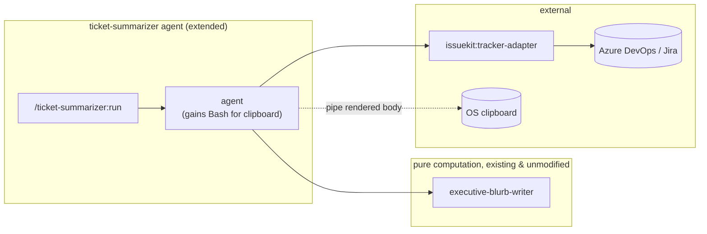

# Spec: Brief export — one-line ticket summaries, range presets, and clipboard delivery for ticket-summarizer

> Owned by: Taha Bikanerwala (taha@incubyte.co)  ·  Started: 2026-09-03  ·  Last revised: 2026-09-03  ·  Spec UUID: 9494f8d2-d1c3-42aa-ae59-7211e11e8fb8
> Anthara spec — slice-decomposed, categorically-framed. Feeds /anthara:create-ticket and /anthara:plan-implementer.

---

## 1. Overview & business context

Taha builds a stakeholder-facing PPT every Monday and Thursday by pulling ticket status out of Azure DevOps. He wants three small, additive upgrades to `ticket-summarizer`, the plugin that already turns tracker work items into plain-language summaries: a `--range` shorthand for "this week" / "last week" / "this month" / "last month" instead of hand-computing `--from`/`--till`, a new default one-line-per-ticket rendering that carries the id, title, blurb, and assignee together (`#3702: Fix Flow Errors After MCP Reauthorization. Flows now recover automatically... (Rajkumar Buddha)`), and a third delivery channel, copy-to-clipboard, alongside the chat-send and file-save the command already offers. The request originally described this as a new panel on the `sprint-status-reporter` Pulse dashboard (input fields, dropdowns, a download button), but a live brainstorming session concluded that shape would duplicate fetch, filtering, and blurb logic `ticket-summarizer` already has hardened over eight commits, add a new stored document and an arbitrary date ceiling to a dashboard whose stated purpose is ambient current-sprint status rather than ad-hoc historical query, and buy little real benefit once "download" turned out to mean clipboard-copy anyway. This spec extends the existing, already-shipped `ticket-summarizer` command in place instead, and leaves `sprint-status-reporter`/Pulse (spec 0001) untouched.

## 2. Sources

| ID | Type | Contributor | Date | Description |
|---|---|---|---|---|
| 1 | Live brainstorming + spec-writing session with Taha | Taha | 2026-09-03 | The Pulse-vs-ticket-summarizer architecture pivot, `--range` presets, brief-line format as the new default, multi-value `--status`, always-offer clipboard delivery |
| 2 | Codebase: `jt-bikanerwala-marketplace/plugins/ticket-summarizer/` (`agents/ticket-summarizer.md`, `commands/run.md`) | n/a | 2026-09-03 | Existing Phase 0-5 flow, `--from`/`--till`/`--status`/`--tags`/`--detailed`/`--to`/`--output` mechanics, the existing "unassigned" convention, the ask-first chat/file delivery pattern, current `tools:` frontmatter (`Skill, Read, Write, AskUserQuestion` — no `Bash`) |
| 3 | Codebase: `jt-bikanerwala-marketplace/plugins/issuekit/skills/tracker-adapter/references/verbs.md` | n/a | 2026-09-03 | `Issue`/`SearchQuery` type shapes, `searchIssues`/`getIssuesBatch` contracts, the substring-tag-matching rationale (`SearchQuery` has no `tags` parameter on either tracker) |
| 4 | Codebase: `jt-bikanerwala-marketplace/plugins/sprint-status-reporter/agents/sprint-status-reporter.md` and `skills/dashboard-composer/SKILL.md` | n/a | 2026-09-03 | The existing `marp-cli` read-only capability-probe pattern (model for clipboard-tool detection), the house style rule against em dashes, the "omit a blurb segment entirely when empty" deck-text convention |
| 5 | Org Memory (`search_memories`: "ticket-summarizer tags active WIQL") | Fabric | 2026-09-03 | `/ticket-summarizer:run --status active --tags ecw` missed a work item created ~18 minutes before the query ran, due to Azure DevOps' WIQL search-index replication lag |
| 6 | `jt-bikanerwala-marketplace/docs/specs/0001-pulse-dashboard-spec.md` | n/a | 2026-09-03 | Sibling spec; source of the "no compliance pack scoped to this repo" finding (reconfirmed directly in this session via `get_standards`, 241 generic org-wide clean-code rules), and of the Pulse dashboard's own stated purpose that this spec's overview argues against extending |
| 7 | `jt-bikanerwala-marketplace/docs/ARCHITECTURE.md` | n/a | 2026-09-03 | Project-wide architecture reference, extracted at this spec's hand-off from spec 0001's and this spec's own §7; authoritative for [§7](#7-architecture) below |

## 3. Type ontology

### 3.1 Kinds of users

- **Report author** — Taha, the sole operator. Runs `/ticket-summarizer:run` in chat and pulls the printed brief lines, or its clipboard copy, into a stakeholder-facing PPT. [1, 2]

### 3.2 Kinds of data

- **Issue** — the existing tracker-adapter type (`id, url, title, body, type, state, assignee, created, updated, resolved, closed, labels, ...`), unchanged by this spec. [3]
- **Range preset** — a named shorthand (`this-week`, `last-week`, `this-month`, `last-month`) that resolves to a concrete `{from, till}` ISO date pair, computed against `today`. New in this spec. [1]
- **Brief line** — the new default one-line rendering of a summarized item: `#<id>: <title>. <blurb> (<assignee>)`, with the blurb segment omitted when `blurb` is empty and the parenthetical reading `(unassigned)` when `assignee` is absent. New in this spec. [1, 2, 4]
- **Clipboard payload** — the exact text handed to the detected clipboard tool: the same body Phase 4 (chat) and Phase 5 (file) already build, rendered per the resolved `include_ids` choice. New in this spec. [1, 2]

### 3.3 Kinds of events

- **Query run** — `/ticket-summarizer:run` invoked in query mode, now optionally carrying `--range` and/or a multi-valued `--status`. [2]
- **Clipboard copy** — the user accepts the "Copy to clipboard?" offer and the agent shells out to a detected clipboard tool. New in this spec. [1]

### 3.4 Kinds of states

- **Delivery channel outcome** — `sent` / `saved` / `copied` / `skipped` / `failed`, per channel (chat, file, clipboard); the existing pattern from chat and file delivery, extended to the new clipboard channel. [2]

## 4. Invariants

**4.1 Existing query semantics are additive, never narrowed** — every currently valid invocation of `/ticket-summarizer:run` (a bare `--status active`, a single-value `--tags ecw`, an explicit ticket list, and so on) continues to resolve exactly the item set it resolves today; `--range` and multi-valued `--status` only add new valid inputs, they never change what an existing single-value input matches. Sources: [1, 2].

**4.2 A channel's failure never corrupts another channel's output** — a failed clipboard copy never blocks, retries, or alters the printed summary ([slice 5.2](#52-print-every-matching-ticket-as-one-ready-to-paste-line)'s Phase 3), a pending chat send, or a pending file save, mirroring the existing invariant that a failed chat send or file save never affects Phase 3's output. Sources: [2].

**4.3 No fabricated field, ever** — the brief line shows only fields the fetch actually returned; a missing assignee renders the literal string `unassigned`, never a guessed name, and a missing blurb omits its segment entirely rather than padding with a placeholder. Sources: [2, 4].

**4.4 Multi-value filters are OR-within, AND-across** — `--status active,closed` matches an item whose resolved status category is either one; `--tags ecw,edtech` matches an item carrying either substring; an item must satisfy at least one value of every filter flag present in the same invocation, mirroring `--tags`'s existing substring-OR contract, now generalized to `--status`. Sources: [2].

**4.5 Read-only, no new write surface** — inherited unmodified: this spec adds no tracker write and no new confirmation gate; clipboard and the existing chat/file channels remain the only side effects, and none of them touch the tracker. Sources: [2].

## 5. Slices

### 5.1 Resolve a week or month range with one flag instead of two dates

Taha runs `/ticket-summarizer:run --range this-month --status closed` instead of computing and typing explicit `--from`/`--till` values by hand. `--range` resolves to a concrete date window before the existing query pipeline runs, completely unchanged beyond that resolution.

- **Touches types:** Range preset.
- **Preserves invariants:** [4.1](#4-invariants).
- **Affected modules:** `plugins/ticket-summarizer/commands/run.md` (extend: document `--range`), `plugins/ticket-summarizer/agents/ticket-summarizer.md` (extend: Phase 0 parsing).
- **Active packs:** none (see [§6](#6-nfrs--regulatory-compliance)).
- **Reachability:** `root → /ticket-summarizer:run --range <preset>`.

**Acceptance criteria**

- [x] **5.1.1** `--range this-week|last-week|this-month|last-month` resolves to a concrete `{from, till}` pair before Phase 1's fetch, computed against `today` (the agent's own clock read; never re-derived downstream).
- [x] **5.1.2** `this-week` resolves to the Monday of the current ISO week through `today` (a trailing partial period, since future dates carry no tickets yet); `last-week` resolves to the Monday through Sunday of the immediately preceding ISO week (a complete period).
- [x] **5.1.3** `this-month` resolves to the 1st of the current calendar month through `today`; `last-month` resolves to the 1st through the last day of the immediately preceding calendar month.
- [x] **5.1.4** `--range` is mutually exclusive with explicit `--from`/`--till`; passing both is a validation error surfaced before any fetch runs, never a silent override.
- [x] **5.1.5** `--range` alone, with no `--status`, behaves exactly as an explicit `--from`/`--till` pair with no `--status` already does today: defaults `date_field` to `updated` and `status_label` to `null`.
- [x] **5.1.6** An unrecognized `--range` value is a validation error listing the four accepted presets, never a silent fallback to any default window.

**Verification (slice complete when these pass):**

1. **Tests.** This plugin family has no automated test suite; it is markdown skill/agent definitions, not application code with a test runner. Verify behaviorally: invoke each of the four `--range` presets on a few different calendar days (start-of-week, mid-week, start-of-month) and confirm the resolved `{from, till}` matches AC 5.1.2/5.1.3 exactly, and that combining `--range` with `--from`/`--till` produces the AC 5.1.4 validation error rather than a silent override.
2. **Migrations.** Not applicable, no schema change.
3. **User-facing flow.** Not applicable, no UI surface; this is a chat-driven CLI command, covered by step 1.
4. **Accessibility.** Not applicable, no UI surface.

### 5.2 Print every matching ticket as one ready-to-paste line

Taha runs `/ticket-summarizer:run --from 2026-08-01 --till 2026-08-31 --status active,closed --tags ecw` and gets back, for every matching ticket, one line ready to drop straight into his deck: `#3702: Fix Flow Errors After MCP Reauthorization. Flows now recover automatically after MCP reauthorization instead of needing a manual resave. (Rajkumar Buddha)`, carrying id, title, blurb, and assignee together, in place of today's bare `- [<id>] <blurb>` bullet, which carries neither title nor assignee by default.

- **Touches types:** Issue, Brief line.
- **Preserves invariants:** [4.1](#4-invariants), [4.3](#4-invariants), [4.4](#4-invariants).
- **Affected modules:** `plugins/ticket-summarizer/commands/run.md` (extend: document the new default format and multi-value `--status`), `plugins/ticket-summarizer/agents/ticket-summarizer.md` (extend: Phase 0 `--status` parsing, Phase 1 default field list, Phase 3 rendering, Phase 4/5 body-building).
- **Active packs:** none.
- **Reachability:** `root → /ticket-summarizer:run` (same entry as [5.1](#51-resolve-a-week-or-month-range-with-one-flag-instead-of-two-dates); new default rendering and widened `--status`).

**Acceptance criteria**

- [ ] **5.2.1** Query-mode and explicit-list results both print in the new brief-line format by default: `#<id>: <title>. <blurb> (<assignee>)`. This replaces the current default rendering; there is no flag to restore the old bullet format.
- [ ] **5.2.2** The `<blurb>` segment, and its leading period, is omitted entirely when `blurb` is `""`, leaving `#<id>: <title> (<assignee>)`.
- [ ] **5.2.3** A missing assignee renders the literal `(unassigned)`, never a blank or omitted parenthetical.
- [ ] **5.2.4** The default fetch (`detailed = false`) always includes `assignee` in its narrow field list, alongside the fields it already fetches; the richer `--detailed` field list is unchanged, but its extra metadata line drops the now-redundant `Assignee:` segment (kept: `State: <state> | Parent: <parent title, or "none">`), since assignee already shows inline on every brief line.
- [ ] **5.2.5** `--status` accepts a comma-separated list of `active|delivered|closed|updated` values; an item matches when its resolved category is any one of them (invariant 4.4); a bare single value behaves exactly as it does today.
- [ ] **5.2.6** `--status active,closed` (or any combination of two or more values) prints one flat brief-line list rather than the delivered/active headed grouping a single `--status` value produces, since a merged multi-state query has no single natural heading.
- [ ] **5.2.7** Chat delivery (Phase 4) and file output (Phase 5) render the same brief-line format, per the existing `include_ids` choice: with ids keeps the leading `#<id>: `, without ids drops it, leaving `<title>. <blurb> (<assignee>)`.
- [ ] **5.2.8** The existing truncation note and unresolved-reference notes are unchanged in wording and continue to appear beneath the (now brief-line) list.

**Verification (slice complete when these pass):**

1. **Tests.** Same behavioral verification approach as [5.1](#51-resolve-a-week-or-month-range-with-one-flag-instead-of-two-dates). Run both an explicit-list invocation and a range/status/tag query against a real tracker project; confirm every printed line matches AC 5.2.1-5.2.3 exactly, including at least one item with no blurb and one with no assignee. Run a `--status active,closed` query and confirm AC 5.2.6's flat-list behavior. Confirm a `--detailed` run's extra line omits `Assignee:` per AC 5.2.4.
2. **Migrations.** Not applicable, no schema change.
3. **User-facing flow.** Not applicable, no UI surface; covered by step 1.
4. **Accessibility.** Not applicable, no UI surface.

### 5.3 Copy the printed summary straight to the clipboard

After the summary prints, Taha is asked once whether to copy it to the clipboard, the same way he is already asked about chat delivery and file save. A "Yes" puts the exact text he would paste into his PPT directly on his system clipboard, no file, no chat round-trip.

- **Touches types:** Clipboard payload, Delivery channel outcome.
- **Preserves invariants:** [4.2](#4-invariants), [4.5](#4-invariants).
- **Affected modules:** `plugins/ticket-summarizer/agents/ticket-summarizer.md` (extend: new Phase after Phase 3; add `Bash` to the `tools:` frontmatter, which today lists only `Skill, Read, Write, AskUserQuestion` — see [source 2](#2-sources)), `plugins/ticket-summarizer/commands/run.md` (extend: document clipboard delivery).
- **Active packs:** none.
- **Reachability:** `root → /ticket-summarizer:run` (same entry as [5.1](#51-resolve-a-week-or-month-range-with-one-flag-instead-of-two-dates) and [5.2](#52-print-every-matching-ticket-as-one-ready-to-paste-line); new delivery channel after Phase 3 prints).

**Acceptance criteria**

- [ ] **5.3.1** A read-only capability probe checks for a first available clipboard tool (`xclip`, `xsel`, `wl-copy`, `pbcopy`, `clip.exe`, checked in that order; first found wins), run once per session, mirroring the plugin family's existing `marp-cli` probe pattern (source 4).
- [ ] **5.3.2** When a tool is detected and the resolved item set is non-empty, the agent asks "Copy this summary to the clipboard?" (Yes/No) immediately after Phase 3 prints, regardless of whether `--to` or `--output` were also given.
- [ ] **5.3.3** On "Yes", if `include_ids` is not already set (from chat or file delivery earlier in the same run), ask the same with-ids/without-ids question those phases already ask; reuse the answer when it is already set.
- [ ] **5.3.4** The clipboard payload is the same body Phase 4/5 already build (brief-line list, truncation note, unresolved-refs notes), rendered per the resolved `include_ids` choice, piped to the detected tool.
- [ ] **5.3.5** On success, confirm `Copied to the clipboard.` On failure (the shell-out errors), report `Could not copy to the clipboard: <reason>. The printed summary above is still the full output.` and do not retry (invariant 4.2).
- [ ] **5.3.6** When no clipboard tool is detected, the offer is skipped entirely, with no message to the user, exactly as the chat offer is already skipped silently when `chat == none`.

**Verification (slice complete when these pass):**

1. **Tests.** Behavioral, same approach as [5.1](#51-resolve-a-week-or-month-range-with-one-flag-instead-of-two-dates)/[5.2](#52-print-every-matching-ticket-as-one-ready-to-paste-line). Run the command on a machine with a clipboard tool present and confirm the offer appears, the payload matches Phase 4/5's body exactly, and pasting elsewhere reproduces it. Run (or simulate) on a machine with none present and confirm the offer is skipped with no message, per AC 5.3.6.
2. **Migrations.** Not applicable, no schema change.
3. **User-facing flow.** Not applicable, no UI surface; covered by step 1.
4. **Accessibility.** Not applicable, no UI surface.

## 6. NFRs & regulatory compliance

No compliance pack (HIPAA, PCI, WCAG, or otherwise) is scoped to `jt-bikanerwala-marketplace` — reconfirmed directly in this session via `get_standards`, which returned the same 241 generic org-wide clean-code rules spec 0001 already found (e.g. "keep controllers and adapters thin," "no fabricated data," pure-function discipline), not a pack-specific ruleset. There is accordingly no §6.N control coverage matrix; no regulatory control applies. Source: [6].

### 6.1 General code-quality conventions carried forward from the existing codebase

**6.1.1 Pure computation stays pure.** `executive-blurb-writer` is untouched by this spec; the brief-line rendering it feeds is built entirely in the agent, the same discipline `dashboard-composer` and `sprint-analyzer` already follow. Sources: [2, 4].

**6.1.2 No fabricated data.** The brief line must never present a field that was not fetched, mirroring the existing agent's "never invent ticket detail" rule. Sources: [2].

**6.1.3 Least-privilege tool grant.** `Bash` is added to `ticket-summarizer`'s `tools:` frontmatter only because clipboard delivery genuinely needs a shell-out; it is not a general-purpose grant, and the agent's only use of it is the capability probe and the clipboard pipe in [slice 5.3](#53-copy-the-printed-summary-straight-to-the-clipboard). Sources: [1, 2].

## 7. Architecture

### 7.1 Tech stack

| Layer | Choice | Rationale |
|---|---|---|
| Runtime | Claude Code plugin (markdown skill + agent definitions), no application runtime | Unchanged; matches the existing `ticket-summarizer` plugin exactly. [2] |
| Persistence | None new | The existing `--output` file-save path is unmodified; clipboard delivery persists nothing beyond the OS clipboard's own transient state. [2] |
| Clipboard access | OS-native clipboard utility (`xclip`/`xsel`/`wl-copy`/`pbcopy`/`clip.exe`), invoked via `Bash` | No new dependency to install; the probe degrades gracefully when none is present, the same posture as the existing `marp-cli` optional-export check. [1, 4] |
| Auth | None beyond the existing tracker MCP auth | Unchanged; no new credential or scope. [2] |

### 7.2 Architectural style

**Style:** *pipe-and-filter* (phase-orchestrated agent + pure-computation skills) — inherited verbatim from `docs/ARCHITECTURE.md` (source 7, itself extracted from spec 0001's §7.2) and from `ticket-summarizer`'s own existing Phase 0-5 structure, not re-chosen.

**Why this style here:** `ticket-summarizer` already implements this style precisely: the agent orchestrates numbered phases, and `executive-blurb-writer` is its one pure-computation skill sibling. This spec's three changes are new phase logic and new flag parsing inside the existing agent (a new Phase 0 branch, a widened Phase 1 field list, a changed Phase 3 render, a new Phase after Phase 3), not a new module that would call for a different style.

**Dependency direction:** unchanged — agent → skill (`executive-blurb-writer`), agent → `issuekit:tracker-adapter` for every read. Skills never call other skills or the agent; only the agent touches `Read`/`Write`/`Bash`.

**Anti-patterns the style forbids:** a computation skill performing I/O or reading the clock (unchanged); the clipboard shell-out happening anywhere but inside the agent; a second place in the codebase re-deriving `--tags`' or `--status`' matching semantics rather than reusing the single implementation in this agent (see this spec's [§1](#1-overview--business-context) rationale for not duplicating this logic inside `sprint-status-reporter`).

### 7.3 Module decomposition

| Module | Responsibility | Depends on |
|---|---|---|
| `commands/run.md` (extended) | Thin CLI entry; documents new flags | agent |
| `agents/ticket-summarizer.md` (extended) | Orchestrates phases; gains the clipboard capability probe and offer; the only module with `Read`/`Write`/`Bash` | `issuekit:tracker-adapter`, `executive-blurb-writer` |
| `skills/executive-blurb-writer/` (existing, unmodified) | `Issue[]` → one-to-two-sentence blurb per item | none |
| `issuekit:tracker-adapter` (existing, unmodified) | Tracker detection, `searchIssues`, `getIssuesBatch` | vendor MCP |

### 7.5 Threat model seed

Low-sensitivity, single-user surface, unchanged from spec 0001's own assessment: sprint/ticket metadata, not PHI or payment data. Clipboard delivery adds no new network surface at all; the copied text never leaves Taha's own machine. The Azure DevOps PAT is a pre-existing credential, unmodified by this spec; this spec adds no tracker write and no new confirmation gate (invariant 4.5).

## 8. Codebase impact map

| Module | Slices that touch it | Likely change shape |
|---|---|---|
| `plugins/ticket-summarizer/commands/run.md` | 5.1, 5.2, 5.3 | Extend: document `--range`, the new default brief format, multi-value `--status`, clipboard delivery |
| `plugins/ticket-summarizer/agents/ticket-summarizer.md` | 5.1, 5.2, 5.3 | Extend: Phase 0 parsing (`--range`, multi-value `--status`), Phase 1 default field list (+`assignee`), Phase 3 rendering (brief line), Phase 4/5 body-building, new Phase after Phase 3 (clipboard offer), add `Bash` to `tools:` frontmatter |
| `plugins/ticket-summarizer/.claude-plugin/plugin.json` | 5.1, 5.2, 5.3 | Version bump; description update |
| `plugins/ticket-summarizer/README.md` | 5.1, 5.2, 5.3 | Extend: document `--range`, the new default format, clipboard delivery |

## 9. Open questions

None. Every unknown surfaced during elicitation (the Pulse-vs-ticket-summarizer architecture question, the brief-format default, the clipboard-offer trigger, the spec's scope, the slice build order, the week-start convention for `--range`) was resolved in-session; see the Changelog and the inline source citations. Nothing here awaits an external stakeholder, data, or review.

---

## Changelog

- 2026-09-03 — Taha Bikanerwala (via Anthara spec-writer) — Initial spec, synthesized from a brainstorming session that started as a proposed Pulse dashboard panel and pivoted, on architectural review, to extending `ticket-summarizer` in place instead [1].
- 2026-09-03 — Taha Bikanerwala (via Anthara spec-writer) — Extracted `docs/ARCHITECTURE.md` from this spec's and spec 0001's §7 at hand-off; added as source 7 and cited from §7.2.
