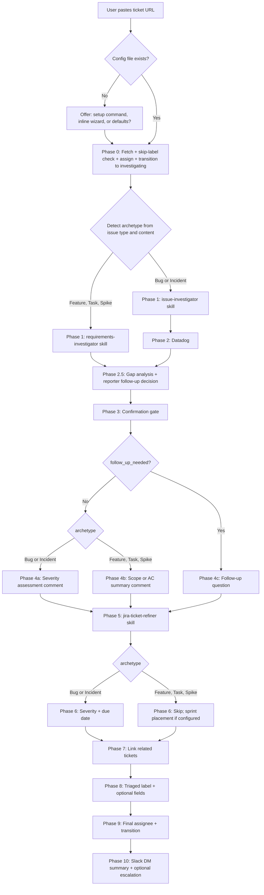

# Design — `jira-issue-triage` plugin (v1.0.0 rename and expansion)

**Date:** 2026-05-01
**Author:** Taha Bikanerwala
**Status:** Approved (ready for implementation plan)
**Architectural revision to:** `2026-04-30-claude-marketplace-design.md`, `2026-04-30-issue-investigator-design.md`, `2026-05-01-jira-ticket-refiner-design.md`

## Goal

Take the v0.3.0 `jira-bug-triage` plugin (one bug-only agent + two bundled skills) and reshape it into a v1.0.0 `jira-issue-triage` plugin that triages **any** Jira ticket archetype (Bug, Incident, Feature, Task, Spike). The agent is renamed from `bug-triage-agent` to `jira-issue-triage`. The workflow gains archetype-aware branches in two phases. A new bundled `requirements-investigator` skill handles Feature/Task/Spike investigation. A `/jira-issue-triage:setup` slash command (plus a first-run wizard fallback inside the agent body) prompts the user for configuration on install so the plugin works without hand-editing JSON.

## Why

- **Current scope is too narrow.** The plugin only handles Bug archetype. A developer picking up a Feature, Task, or Spike ticket gets no help: no investigation, no refinement orchestration, no auto-assign, no transition. They have to drive the bundled skills manually, one at a time.
- **The bundled skills are already general-purpose.** `jira-ticket-refiner` already handles all five archetypes with a per-archetype template map. `issue-investigator`'s search ladder works for any ticket, only the report template is bug-specific. The agent is the only piece that's bug-locked.
- **Configuration is a barrier to install.** Today a new user has to read the README, copy the example config, edit the JSON, and figure out which fields apply to their Jira instance. Most users skip this and the agent runs with implicit defaults that don't match their workflow. A wizard removes the barrier.
- **The rename communicates the new scope.** "jira-bug-triage" advertises bug-only; "jira-issue-triage" reads as general. The breaking change is worth eating once at the v0.x to v1.0 transition rather than carrying confusing naming forward.

## Architectural revision

The original marketplace design (`2026-04-30-claude-marketplace-design.md`) treated the plugin as bug-only and listed three sibling skills as future separate plugins. By v0.3.0, two of those skills (`issue-investigator`, `jira-ticket-refiner`) had been bundled in. This spec changes more:

- Plugin name: `jira-bug-triage` → `jira-issue-triage`. Folder, manifest, and marketplace.json all updated.
- Plugin scope: Bug archetype only → all five archetypes (Bug, Incident, Feature, Task, Spike).
- Agent name: `bug-triage-agent` → `jira-issue-triage` (drop the `-agent` suffix per user direction).
- Bundled skills: 2 → 3. New skill `requirements-investigator` joins `issue-investigator` and `jira-ticket-refiner`.
- New component: slash command `/jira-issue-triage:setup` at `commands/setup.md`.
- Agent first-run wizard: detects missing config and offers three options (run setup command, inline wizard, defaults).
- Config file path: `.claude/jira-bug-triage.config.json` → `.claude/jira-issue-triage.config.json`. Old path read with deprecation warning for one minor version (1.x).
- Plugin version: 0.3.0 → 1.0.0. Major bump because the rename is a breaking change for anyone with the v0.3.0 install.

The remaining sibling skill (`prose-style`) stays as a planned separate plugin. No change there.

## Decisions

These four design choices were nailed down with the user via brainstorming before this spec was written. They drive the rest of the document.

| Decision | Choice |
|----------|--------|
| Workflow architecture | Generic core for all archetypes; bug/incident-specific phases (severity assessment + due date + escalation) gate on archetype; feature/spike-specific phase (scope summary) gates on archetype. |
| Configuration UX | Both. Ship the slash command `/jira-issue-triage:setup` AND have a first-run wizard inside the agent body. |
| Plugin rename scope | Full rename. Folder, manifest, marketplace.json, agent name, config path. v1.0.0 bump. Breaking change. |
| Investigation skill split | Two skills. `issue-investigator` stays Bug/Incident-only. New bundled `requirements-investigator` for Feature/Task/Spike. |

## Architecture

### Workflow flow



### Phase-by-phase change log (v0.3.0 → v1.0.0)

| Phase | Change |
|-------|--------|
| Prerequisites | Add a Configuration step that detects missing config and offers wizard/setup-command/defaults choice. Read both new and legacy config file paths. |
| Phase 0 | Add archetype detection right after fetch. Cache the archetype string (`Bug` / `Incident` / `Feature` / `Task` / `Spike`) for downstream phases. Use the same Bug/Feature/Task/Incident/Spike rules `jira-ticket-refiner` already uses (issue-type field as a hint, content drives the final classification). |
| Phase 1 | Branch by archetype: Bug/Incident → call `issue-investigator`; Feature/Task/Spike → call `requirements-investigator`. Both skills live in the same plugin. |
| Phase 2 | Bug/Incident only. Datadog log search rarely useful for non-bug tickets; skip silently for Feature/Task/Spike. |
| Phase 2.5 | Universal. Gap analysis applies to any ticket where investigation is incomplete (e.g., Feature ticket missing AC, Spike ticket with no scope). Reporter follow-up decision uses the same three scenarios (missing data, clarification, fix verification). On non-bug archetypes, "fix verification" reframes as "still relevant?". |
| Phase 3 | Universal. Same confirmation-gate behavior. Surface the archetype-aware proposed Phase 4 (severity assessment vs scope summary) in the preview. |
| Phase 4 | Split into three lettered sub-phases: 4a Severity Assessment (Bug/Incident, replaces old Phase 4), 4b Scope Summary (Feature/Task/Spike, new), 4c Follow-up Question (universal, replaces old Phase 4b with the letter bumped). Exactly one of 4a/4b/4c runs per ticket. |
| Phase 5 | Universal. Calls `jira-ticket-refiner` (already archetype-aware). |
| Phase 6 | Bug/Incident only. Skip on Feature/Task/Spike. Optional: if `sprint_field_name` is configured, do a one-call sprint placement instead. |
| Phase 7 | Universal. |
| Phase 8 | Universal. |
| Phase 9 | Universal. Final transition rules adjust by archetype: Bug/Incident lowest-severity → backlog (current behavior); Feature/Task/Spike → stay in `investigating` for the owning team to pick up (no auto-backlog because there's no severity to gate on). |
| Phase 10 | Universal. New outcome strings for Feature/Task/Spike paths. Escalation routing only fires for Bug/Incident with `escalate_immediately: true`. |

## Components

### Renamed: agent file

| Field | Before | After |
|-------|--------|-------|
| File path | `plugins/jira-bug-triage/agents/bug-triage-agent.md` | `plugins/jira-issue-triage/agents/jira-issue-triage.md` |
| Frontmatter `name` | `bug-triage-agent` | `jira-issue-triage` |
| Frontmatter `description` | "Triages a Jira **bug** ticket end-to-end..." | "Triages a Jira **issue** end-to-end across all archetypes (Bug, Incident, Feature, Task, Spike)..." |
| Frontmatter `tools` | (existing list) | Same list (no MCP additions; archetype awareness is body-side, not tool-side) |

### New: setup slash command

**Path:** `plugins/jira-issue-triage/commands/setup.md`

**Frontmatter:**
```yaml
---
description: First-time setup wizard for jira-issue-triage. Walks through configuration questions and writes .claude/jira-issue-triage.config.json.
argument-hint: (no args)
---
```

**Body responsibilities:**
1. Check whether `.claude/jira-issue-triage.config.json` already exists. If yes, show current values and ask whether to overwrite (default: no).
2. Auto-discover defaults via `getAccessibleAtlassianResources` and `atlassianUserInfo` so the wizard can suggest the project key (from the user's accessible site) and severity field name (auto-discover ladder from the existing agent: `Severity Level` → `Severity` → `Bug Severity` → `priority`).
3. Walk through the wizard questions one at a time. Use `AskQuestion` for multiple-choice answers; free text for names and emails.
4. After the last question, show the assembled config as JSON and ask for final approval.
5. Write `.claude/jira-issue-triage.config.json` with sorted keys and 2-space indent for stable diffs.
6. Print a one-line confirmation: `Wrote .claude/jira-issue-triage.config.json. You can re-run /jira-issue-triage:setup any time to update.`

**Wizard questions (8):**

| # | Question | Type | Default |
|---|----------|------|---------|
| 1 | Default project key (or "infer from URL") | Free text or "infer" | "infer" |
| 2 | Severity field name | Multiple choice from auto-discovered options + "custom" | First match from auto-discovery |
| 3 | Triaged label | Free text | `triaged` |
| 4 | Skip labels (comma-separated) | Free text | (empty) |
| 5 | Transition names: investigating, waiting_reply, backlog | Three free-text inputs | `Under Investigation`, `Waiting for Reply`, `Backlog` |
| 6 | Severity scheme: 3-tier default or custom | Multiple choice (3-tier / 5-tier / custom) | 3-tier |
| 7 | Escalation: slack channel, primary contact (name + email), fallback contact (name + email) | Free text per field | All null |
| 8 | Save? | Yes/no | Yes |

The advanced fields (`scope_summary_field_name`, `sprint_field_name`, `story_points_field_name`, `non_bug_transitions`) are NOT asked in this v1.0.0 wizard. The README documents them as advanced configuration users can add by hand. Reasoning: keeping the wizard short matters more than completeness for v1.0.0; advanced fields can land in v1.1.0 if real users hit the gap.

### New: agent first-run wizard fallback

In the new agent body's Prerequisites section, immediately after the Identity step, add a Configuration step:

```
1. Look for `.claude/jira-issue-triage.config.json`. Also look for the legacy `.claude/jira-bug-triage.config.json` for back-compat.
2. If only the legacy file exists, read it but warn the user once: "Found legacy config at .claude/jira-bug-triage.config.json. Consider renaming to .claude/jira-issue-triage.config.json (the agent will keep reading both for now; legacy support is removed in 2.0.0)."
3. If neither exists, pause and ask:
   "I don't see a configuration file. Choose how to proceed:
   (a) Run /jira-issue-triage:setup to walk through the setup wizard, then re-paste the ticket.
   (b) Let me ask the same questions inline before triaging this ticket.
   (c) Use defaults (sensible for most teams: 3-tier severity, no escalation, infer project key from URL)."
4. If (a), exit cleanly so the user can run the slash command. If (b), inline-walk the same 8 questions and write the file. If (c), proceed with defaults and append a one-line note in the Phase 10 DM: "Triaged with default config; run /jira-issue-triage:setup any time to customize."
```

The inline wizard logic is intentionally a copy of the slash command body's logic. Two near-identical bodies is acceptable here because (a) they're both prompts for the model rather than code, and (b) factoring the shared logic into a third file would force `Skill`-style indirection that complicates the agent body.

### New: `requirements-investigator` skill

**Path:** `plugins/jira-issue-triage/skills/requirements-investigator/SKILL.md` plus `references/report-template.md`.

**Frontmatter:**
```yaml
---
name: requirements-investigator
description: "Investigates a non-bug Jira ticket (Feature, Task, Spike) by reading the ticket and linked design or product docs, searching Slack and Confluence for prior decisions, and producing an evidence-tagged orientation report. Use when a developer is about to pick up a Feature, Task, or Spike ticket and wants context before starting work."
metadata:
  author: Taha Bikanerwala
tools: Read, Bash, Grep, mcp__plugin_atlassian_atlassian__getJiraIssue, mcp__plugin_atlassian_atlassian__searchJiraIssuesUsingJql, mcp__plugin_atlassian_atlassian__searchConfluenceUsingCql, mcp__plugin_slack_slack__slack_search_public_and_private, mcp__plugin_slack_slack__slack_read_thread
---
```

**Calling convention:** mirrors `issue-investigator` exactly. Non-interactive, predictable structure, evidence tags, output-is-the-last-thing, read-only. The agent calls it via the `Skill` tool the same way it calls `issue-investigator`.

**Search ladder:** three levels (Datadog dropped because non-bug tickets rarely have runtime telemetry to query):

| Level | Sources | Gate |
|-------|---------|------|
| 1 | Slack search (ticket key, feature name, related decisions) + thread reads | Confirmed scope, AC, or decision found |
| 2 | Ticket re-read (full description, comments, linked tickets) + Jira related-ticket search + Confluence (product briefs, design docs, runbooks, RFCs) | Authoritative spec or design doc found |
| 3 | Code (only when the ticket references existing code that needs context) | n/a (terminal level) |

**Evidence tags:** identical to `issue-investigator` — `[VERIFIED]`, `[OBSERVED]`, `[INFERRED]`, `[UNKNOWN]`.

**Report templates** (per archetype, full text in `references/report-template.md`):

- **Feature:** Lead, Background, Requirements Found, Design Refs, Open Questions, Where To Look
- **Task:** Lead, Why Now, Definition of Done Found, Risks, Where To Look
- **Spike:** Lead, Question to Answer, What's Already Known, What's Unknown, Where To Look

Each section has a 1-2 sentence definition in the reference file. The skill picks the template by archetype (passed by the agent, or inferred from issue type when standalone).

### Modified: `issue-investigator` skill

**Frontmatter `description`** tightens to clarify scope:

> Investigates a Jira **Bug or Incident** ticket by searching Slack, the ticket and related Jira/Confluence pages, Datadog, and the codebase, then writes an evidence-tagged report in the bug-archetype template. Use when a Bug or Incident ticket needs an investigation report before triage decisions are made. For Feature, Task, or Spike tickets, see `requirements-investigator`.

**Body:** add a one-line note at the top of the file, right after the existing intro paragraph:

> **Scope:** Bug and Incident archetypes. For Feature, Task, or Spike tickets, the agent calls `requirements-investigator` instead.

No other body changes. The 6-section report template, search ladder, and writing rules are all kept as-is.

### Modified: `jira-ticket-refiner` skill

Two small references update:

- Calling Convention paragraph mentions `bug-triage-agent` once. Change to `jira-issue-triage`.
- Step 1 (Fetch) reuse-the-payload note mentions `the bug-triage agent in Phase 5`. Change to `the jira-issue-triage agent in Phase 5`.

Phase numbering stays at 5 because the new agent body keeps the same phase numbering (Phases 4a/4b/4c are sub-letters of the old Phase 4 slot). No template changes; the refiner is already archetype-aware.

### Modified: plugin manifest

```json
{
  "name": "jira-issue-triage",
  "version": "1.0.0",
  "description": "End-to-end Jira issue triage subagent across all archetypes (Bug, Incident, Feature, Task, Spike). Bundles three skills (issue-investigator for Bug/Incident, requirements-investigator for Feature/Task/Spike, jira-ticket-refiner for any archetype) and ships a /jira-issue-triage:setup wizard.",
  "author": { "name": "Taha Bikanerwala", "url": "https://github.com/TahaBikanerwala" },
  "homepage": "https://github.com/TahaBikanerwala/jt-bikanerwala-marketplace",
  "repository": "https://github.com/TahaBikanerwala/jt-bikanerwala-marketplace",
  "license": "MIT",
  "keywords": ["jira", "issue", "triage", "bug", "feature", "spike", "subagent", "atlassian"]
}
```

### Modified: marketplace manifest

```json
{
  "name": "jt-bikanerwala-marketplace",
  "description": "Taha Bikanerwala's Claude Code plugins.",
  "owner": { "name": "Taha Bikanerwala", "url": "https://github.com/TahaBikanerwala" },
  "plugins": [
    {
      "name": "jira-issue-triage",
      "source": "./plugins/jira-issue-triage",
      "description": "End-to-end Jira issue triage subagent across all archetypes. Bundles issue-investigator (Bug/Incident), requirements-investigator (Feature/Task/Spike), and jira-ticket-refiner (any archetype). Ships a /jira-issue-triage:setup wizard."
    }
  ]
}
```

## Configuration model

### File path

- New: `.claude/jira-issue-triage.config.json` (project-local).
- Legacy: `.claude/jira-bug-triage.config.json`. Read for back-compat through 1.x. Removed in 2.0.0. Agent warns once per session when the legacy path is the only one present.

### Schema (full)

```json
{
  "project_key": null,
  "severity_field_name": null,
  "triaged_label": "triaged",
  "skip_labels": [],
  "transitions": {
    "investigating": "Under Investigation",
    "waiting_reply": "Waiting for Reply",
    "backlog": "Backlog"
  },
  "severity_scheme": {
    "Sev-1": { "due_offset_days": 7,  "escalate_immediately": true  },
    "Sev-2": { "due_offset_days": 14, "escalate_immediately": false },
    "Sev-3": { "due_offset_days": 90, "escalate_immediately": false }
  },
  "escalation": {
    "slack_channel": null,
    "primary_contact": null,
    "fallback_contact": null
  },
  "scope_summary_field_name": null,
  "sprint_field_name": null,
  "story_points_field_name": null,
  "non_bug_transitions": {
    "ready": null
  }
}
```

### Defaults when config absent

Identical to v0.3.0:
- `project_key`: inferred from ticket URL prefix.
- `severity_field_name`: auto-discovery order `Severity Level` → `Severity` → `Bug Severity` → `priority`.
- `triaged_label`: `triaged`.
- `skip_labels`: empty.
- `transitions`: as shown.
- `severity_scheme`: 3-tier (7/14/90 days).
- `escalation`: all null.
- `scope_summary_field_name`, `sprint_field_name`, `story_points_field_name`, `non_bug_transitions.ready`: all null. When null, the agent skips the steps that reference them.

### New optional fields explained

- `scope_summary_field_name`: Some Jira instances have a custom rich-text "Scope Summary" or "Acceptance Criteria" field. If set, Phase 4b writes the scope summary to this field in addition to (or instead of) posting it as a comment. If null (default), Phase 4b only posts the comment.
- `sprint_field_name`: If set, Phase 6 (on Feature/Task/Spike paths) attempts to add the ticket to the current active sprint of the configured project. If null, Phase 6 skips silently for non-bug archetypes.
- `story_points_field_name`: If set, Phase 6 (on Feature/Task/Spike paths) prompts the user for a story-point estimate during the Phase 3 confirmation gate, then writes it to the field. If null, no estimate is written.
- `non_bug_transitions.ready`: Optional override for Phase 9's "Feature/Task/Spike final transition." If set, Phase 9 uses this transition for non-bug archetypes after triage instead of leaving the ticket in `investigating`.

All four fields are optional in v1.0.0 and not asked by the wizard. Documented in the README's advanced section.

## Migration story

For users who installed `jira-bug-triage` v0.3.0:

1. **Plugin install:** `/plugin uninstall jira-bug-triage` then `/plugin install jira-issue-triage` from the same marketplace. The marketplace manifest update means the new plugin shows up with the new name.
2. **Config file:** the agent reads both `.claude/jira-issue-triage.config.json` (preferred) and `.claude/jira-bug-triage.config.json` (legacy). If only the legacy path exists, the agent reads it and warns once per session. Renaming the file to the new path is recommended; the agent treats the rename as zero-effort because the schema is a strict superset (all v0.3.0 keys still apply).
3. **Slash command:** new `/jira-issue-triage:setup` available immediately after install. Re-running it on an existing config offers to overwrite or keep current.
4. **Agent name:** the `bug-triage-agent` no longer exists after the rename. Calls in scripts or CLAUDE.md memory files that reference it by name need to be updated to `jira-issue-triage`. Documented in the migration note.

## Architecture-update side effects

| File | Change |
|------|--------|
| `plugins/jira-bug-triage/` (folder) | Renamed to `plugins/jira-issue-triage/` via `git mv`. Preserves history. |
| `plugins/jira-issue-triage/agents/bug-triage-agent.md` | Renamed to `plugins/jira-issue-triage/agents/jira-issue-triage.md` via `git mv`. Body rewritten for archetype awareness, frontmatter updated. |
| `plugins/jira-issue-triage/.claude-plugin/plugin.json` | Name, version (0.3.0 → 1.0.0), description, keywords updated. |
| `.claude-plugin/marketplace.json` | Plugin name, source path, description updated. |
| `plugins/jira-issue-triage/README.md` | Full rewrite for new scope, setup command, three skills, migration note. |
| `README.md` (repo root) | Plugin row updated: name, version, description. New "What changed in 1.0.0" paragraph linking to this spec. |
| `plugins/jira-issue-triage/skills/issue-investigator/SKILL.md` | Frontmatter description tightened to Bug/Incident scope. One-line note at top. |
| `plugins/jira-issue-triage/skills/jira-ticket-refiner/SKILL.md` | Two text references updated (`bug-triage-agent` → `jira-issue-triage`). |
| **New:** `plugins/jira-issue-triage/commands/setup.md` | Slash command body. |
| **New:** `plugins/jira-issue-triage/skills/requirements-investigator/SKILL.md` | New skill body. |
| **New:** `plugins/jira-issue-triage/skills/requirements-investigator/references/report-template.md` | Per-archetype report templates. |
| **New:** `docs/superpowers/specs/2026-05-01-jira-issue-triage-design.md` | This spec. |
| **New:** `docs/superpowers/plans/2026-05-01-jira-issue-triage.md` | Implementation plan. |
| `docs/superpowers/specs/2026-04-30-claude-marketplace-design.md` | Append `## Architectural revision (2026-05-01b)` note. |
| `docs/superpowers/specs/2026-04-30-issue-investigator-design.md` | Append `## Update (2026-05-01b)` note. |
| `docs/superpowers/specs/2026-05-01-jira-ticket-refiner-design.md` | Append `## Update (2026-05-01b)` note. |
| `docs/superpowers/plans/2026-05-01-jira-ticket-refiner.md` | Append rename-impact section. |

## Versioning

- Plugin: `0.3.0` → `1.0.0`. Major bump because the rename, agent-name change, and config-path change are all breaking for v0.3.0 installs.
- Marketplace tag: `v1.0.0` after merge.

## Validation plan

After implementation:

1. JSON validators on `marketplace.json` and `plugin.json`.
2. YAML frontmatter validator on every `.md` file with frontmatter (agent, three SKILL.md files, slash command).
3. Grep audits:
   - `bug-triage-agent` references should appear ONLY in: rename-history notes (specs and plans documenting the rename), back-compat code paths in the agent body (legacy config file path, migration messages).
   - `jira-bug-triage` plugin references should appear ONLY in: same rename-history notes, migration paragraph in plugin README, legacy config-file-path back-compat in agent body.
   - `.claude/jira-bug-triage.config.json` should appear ONLY in back-compat code in the agent body and the migration paragraph in plugin README.
4. Cross-file consistency check: config schema appears identically in agent body, plugin README, setup command body, and this spec. Phase numbering matches between agent body, plugin README, and this spec. Skill names referenced in agent body all resolve to real skill folders.
5. Em-dash and LLM-vocab scans on all new prose.
6. Spring Health leakage scan (custom field IDs, named people, internal channel names).
7. Local install: `/plugin marketplace add /home/taha/Desktop/MyProjects/taha-bikanerwala-marketplace`, `/plugin install jira-issue-triage`. Verify the agent + 3 skills + 1 slash command all appear. Run `/jira-issue-triage:setup` end to end and confirm the config file is written.
8. Smoke test on a real Bug ticket and a real Feature ticket. Confirm Phase 4 branches correctly (4a vs 4b) and Phase 6 is skipped on Feature.
9. Push to GitHub, tag `v1.0.0`, retest from public marketplace.

## Out of scope

- Renaming `jira-ticket-refiner` (already archetype-aware, name fits).
- Renaming `issue-investigator` (name still fits its scope; description tightened).
- Building `prose-style` (still planned for later).
- Non-Jira issue trackers (Linear, GitHub Issues, ServiceNow).
- Auto-migrating the legacy config file to the new path (read-both with deprecation warning is enough for 1.x).
- Wiring the setup wizard to interactively pick custom Jira field IDs (the wizard asks by name; the agent resolves IDs at runtime via the existing auto-discovery path).
- Visual companion / mockups (this is a docs and config change, not a UI change).
- Backfilling Story Points or Sprint placement logic for the Feature workflow (config has slots; logic is best-effort with skip-on-absent).
- Adding `scope_summary_field_name`, `sprint_field_name`, `story_points_field_name`, `non_bug_transitions` to the v1.0.0 wizard (documented as advanced configuration; can land in v1.1.0).
